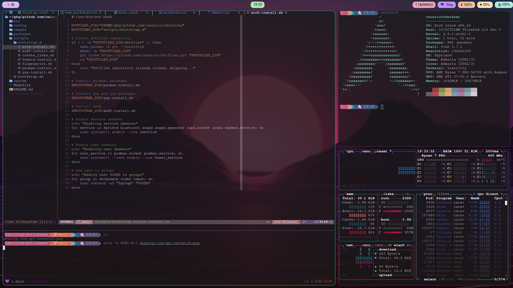

# Cacaricos dotfiles

This repository contains the configuration files for my ThinkPad L14 Gen 3 Amd Ryzen.
I'm not an experienced Rice maker, the only rice I know how to cook is Brazilian Rice, but take a look, you might find some stuff usefull.
Feel free to clone my configurations and give some ideas on how to improve them.


```
                   -`
                  .o+`
                 `ooo/
                `+oooo:
               `+oooooo:
               -+oooooo+:
             `/:-:++oooo+:
            `/++++/+++++++:              cacarico@darknet
           `/++++++++++++++:             ----------------
          `/+++ooooooooooooo/`           OS: Arch Linux x86_64
         ./ooosssso++osssssso+`          Host: 21C5CTO1WW ThinkPad L14 Gen 3
        .oossssso-````/ossssss+`         Kernel: 6.9.1-arch1-1
       -osssssso.      :ssssssso.        Uptime: 1 hour, 47 mins
      :osssssss/        osssso+++.       Packages: 880 (pacman)
     /ossssssss/        +ssssooo/-       Shell: fish 3.7.1
   `/ossssso+/:-        -:/+osssso+-     Resolution: 1920x1200
  `+sso+:-`                 `.-/+oso:    DE: Hyprland
 `++:.                           `-/+/   Theme: Adwaita [GTK2/3]
 .`                                 `/   Icons: Adwaita [GTK2/3]
                                         Terminal: tmux
                                         CPU: AMD Ryzen 7 PRO 5875U with Radeon Graphics (16) @ 4.546GHz
                                         GPU: AMD ATI 07:00.0 Barcelo
                                         Memory: 4026MiB / 30878MiB
```



## Requirements

The are no requiremets needed to install this project.
The only command needed is `make` and even the smaller Arch image contains it.

## Installation

You can run `make` without any argument for a list of options.


### install

The `make install` will install all packages I use, this contain a huge list of packages so I strongly recomend to open the `packages/*.install` files and remove the packages you don't want.\
This will also create the symbolic links in your $HOME/.config folder.\
:warning: This can overwrite your already existing symlinks if any.\

Clone the repo and run `make arch_install`, this will create a symbolic link of the configuration files to your $HOME dir.

```
git clone git@github.com:cacarico/dotfiles.git
cd dotfiles
make full_install
```

Or with `ghq` :p
```
ghq git@github.com:cacarico/dotfiles.git
cd $HOME/ghq/github.com/cacarico/dotfiles
make full_install
```

### links

The `make links` will only create the symbolic links in your $HOME/.config folder.
:warning: This can overwrite your already existing symlinks if any.

### package_install

The `make install` will only install the packages I use, to be honest I don't think you'll only wanna install the shit I have.


## Config

### Fish

Have my personal abreviatons, configs and functions for fish.

Configs
* nnn
* peco

Funtions
* n

#### Oh My Fish

All plugins I have installed for omf

```
omf install aws git fish kubectl fish-kubectl-completions omf fish-spec z

```

### Nvim

Lots of configuration for my NeoVim editor.

coc configuraton
* enable terraform language server


Configs for:
* NERDTree
* Glow
* Fugitive
* Telescope
