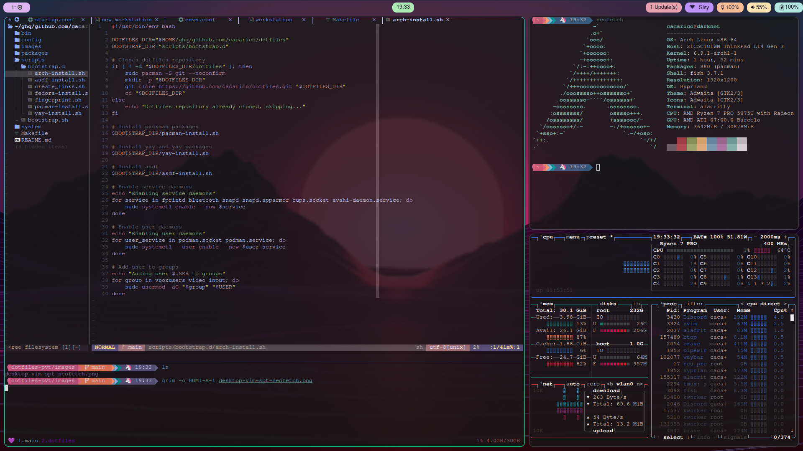

# Hyprland Documentation

## Keybindings

### General Keybindings

| Key Combination           | Action                                 |
|---------------------------|----------------------------------------|
| SUPER + Alt + r           | Exit Hyprland                          |
| SUPER + w                 | Close the active window                |
| SUPER + SHIFT + b         | Toggle Waybar                          |
| SUPER + ALT + o           | Change keyboard layout                 |

### Fullscreen and Floating

| Key Combination           | Action                                 |
|---------------------------|----------------------------------------|
| SUPER + f                 | Toggle fullscreen mode                 |
| SUPER + c                 | Maximize current window                |
| SUPER + SHIFT + F         | Toggle floating mode for current window|

### Dwindle Layout

| Key Combination           | Action                                 |
|---------------------------|----------------------------------------|
| SUPER + SHIFT + p         | Toggle pseudotiling                    |
| SUPER + SHIFT + s         | Toggle split direction                 |

### Windows and Workspaces

| Key Combination           | Action                                 |
|---------------------------|----------------------------------------|
| SUPER + h / l / k / j     | Move focus left / right / up / down    |
| SUPER + CTRL + h / l      | Move window left / right               |
| SUPER + CTRL + k / j      | Move window up / down                  |
| SUPER + SHIFT + l / h     | Resize window right / left             |
| SUPER + SHIFT + k / j     | Resize window up / down                |
| SUPER + [1-10]            | Switch to workspace 1-10               |
| SUPER + SHIFT + [1-10]    | Move window to workspace 1-10          |
| SUPER + Scroll Down       | Switch to next workspace               |
| SUPER + Scroll Up         | Switch to previous workspace           |
| SUPER + Tab               | Switch to next workspace               |
| SUPER + SHIFT + Tab       | Switch to previous workspace           |
| SUPER + Left Mouse Button | Move window                            |
| SUPER + Right Mouse Button| Resize window                          |

### Program Launchers

| Key Combination           | Action                                 |
|---------------------------|----------------------------------------|
| SUPER + Return            | Launch terminal                        |
| SUPER + Space             | Open application menu                  |
| SUPER + e                 | Launch `yazi` file manager             |
| SUPER + SHIFT + e         | Launch `pcmanfm` file manager          |
| SUPER + SHIFT + q         | Lock the screen                        |
| SUPER + b, b              | Launch Brave browser                   |
| SUPER + b, f              | Launch Firefox                         |
| SUPER + o, o              | Launch Obsidian                        |
| SUPER + o, p              | Launch `pavucontrol`                   |
| SUPER + o, b              | Launch `bluetoothctl`                  |
| SUPER + o, a              | Launch `arandr`                        |
| SUPER + o, n              | Launch `nmtui` in floating terminal    |

### Scratchpad Submap

| Key Combination           | Action                                 |
|---------------------------|----------------------------------------|
| SUPER + s, s              | Toggle scratchpad workspace 1          |
| SUPER + SHIFT + s, s      | Move window to scratchpad workspace 1  |
| SUPER + s, a              | Toggle scratchpad workspace 2          |
| SUPER + SHIFT + s, a      | Move window to scratchpad workspace 2  |
| SUPER + s, d              | Toggle scratchpad workspace 3          |
| SUPER + SHIFT + s, d      | Move window to scratchpad workspace 3  |

## Key Settings and Customizations

### General Settings
The general section includes various fundamental settings for Hyprland:

* **gaps_in**: Inner gaps between windows.
* **gaps_out**: Outer gaps around the screen edge.
* **border_size**: Width of window borders.
* **col**.active_border: Color of the active window border.
* **col.inactive_border**: Color of the inactive window border.
* **resize_on_border**: Enable resizing windows by clicking and dragging on borders and gaps.
* **allow_tearing**: Allow screen tearing (refer to Hyprland's tearing documentation before enabling).
* **layout**: Default layout for windows (e.g., dwindle).

### Decoration
The decoration section manages the appearance and behavior of window decorations:

**rounding**: Window corner rounding.
**active_opacity**: Opacity of focused windows.
**inactive_opacity**: Opacity of unfocused windows.
**drop_shadow**: Enable drop shadows for windows.
**shadow_range**: Range of the drop shadow.
**shadow_render_power**: Intensity of the drop shadow.
**col.shadow**: Color of the drop shadow.

#### Blur
Settings for window blur effects:

**enabled**: Enable blur effects.
**size**: Blur size.
**passes**: Number of blur passes.
**vibrancy**: Adjust vibrancy effect.

### Animations
The animations section configures animations for various window actions:

**enabled**: Enable animations.
**bezier**: Custom bezier curve for animations.
**animation**: Define animations for windows, borders, fade effects, and workspaces.

### Dwindle Layout
The dwindle section configures settings specific to the dwindle layout:

**pseudotile**: Enable pseudotiling (bound to mainMod + P by default).
**preserve_split**: Preserve the split direction for new windows.
**force_split**: Force a specific split direction (0 = follow mouse, 1 = always left/top, 2 = always right/bottom).

### Master Layout
The master section configures settings specific to the master layout:

**new_is_master**: Make new windows the master window.

### Miscellaneous Settings
The misc section includes other settings that do not fit into the categories above:

**force_default_wallpaper**: Disable anime mascot wallpapers (0 or 1).
**disable_hyprland_logo**: Disable the Hyprland logo or anime girl background.

### Troubleshooting
If you encounter issues, check the following:

Ensure all dependencies are installed.
Verify the configuration file syntax.
Check logs for errors: ~/.config/hypr/hyprland.log.

# Resources
Hyprland GitHub Repository
Hyprland Wiki
Hyprland Community
